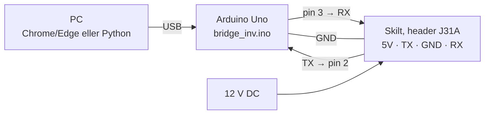

# LED-skilt kontrollsenter

[](https://github.com/audlind/led-skilt-kontrollsenter/actions/workflows/test.yml)

Reverse engineering av et rullende LED-skilt (**Clas Ohlson 36-2071**, 7 × 80 røde LED-er, kontrollerkort **Amplus AM03127-H11**), og et komplett kontrollsenter for å styre det fra PC: tekst, piksler, animasjoner, klokke og tidsplaner.

<p align="center">
  
</p>

Skiltet har ingen offisiell PC-programvare lenger, og seriellprotokollen er bare delvis dokumentert. Dette repoet samler det som er målt og bevist mot et ekte skilt: **maskinvaren, signalnivåene, protokollen, grafikkformatet og teknikkene som gir blinkefrie animasjoner**, pluss kode som gjør det enkelt å bruke.

## Innhold

- **Kontrollsenter** (webapp, ren HTML/JS, Chrome/Edge): skiltet gjenskapt på skjermen, tekstbygger, pikselstudio, animasjonsbibliotek med forhåndsvisning, tidslinje, opplasting, system- og tidsplanverktøy, pakkemonitor og diagnose. Kobler direkte til skiltet over USB med Web Serial, eller kjører i simulator uten skilt.
- **Python-bibliotek og animasjoner** for skripting fra kommandolinjen.
- **Arduino-bro** som snur skiltets inverterte serielle signaler, så en vanlig USB-forbindelse virker.
- **Dokumentasjon** av maskinvare, protokoll, animasjonsteknikk og alt som avviker fra databladet.

## Kom i gang

### 1. Det du trenger

- Skiltet (Clas Ohlson 36-2071 eller annet Amplus AM03127-skilt) og en 12 V DC-adapter
- Arduino Uno (eller klone) med USB-kabel
- Tre jumperledninger
- PC med Chrome eller Edge (kontrollsenteret), og/eller Python 3 med `pyserial` (skriptene)

### 2. Koble sammen

Skiltets serielle linjer hviler på **0 V** (invertert logikk), så de kan ikke kobles rett på en USB-seriell-adapter. Uno-en snur signalet i programvare og fungerer som USB-bro.



| Arduino Uno | Skiltets J31A |
|---|---|
| Pin 2 | TX |
| Pin 3 | RX |
| GND | GND |
| (ikke koblet) | 5V |

RESET-jumperen skal ikke sitte på. Se [docs/hardware.md](docs/hardware.md) for kretskortbilder, strømforsyning og signalmålinger.

### 3. Last opp bro-sketchen

Åpne [`arduino/bridge_inv/bridge_inv.ino`](arduino/bridge_inv/bridge_inv.ino) i Arduino IDE (kort: Arduino Uno) og last opp. Sketchen er 25 linjer: den videresender bytes mellom USB og skiltet med `SoftwareSerial(2, 3, true)` (invertert logikk) på 9600 baud.

### 4a. Kontrollsenteret

```
cd kontrollsenter
start.bat            # eller:  python serve.py
```

Chrome eller Edge åpnes på `http://localhost:8765`. Trykk **KOBLE TIL SKILT** og velg Arduino Uno. Appen sender en kontakttest og sier fra hvis skiltet ikke svarer. **SIMULATOR** lar deg prøve alt uten skilt. Se [docs/kontrollsenter.md](docs/kontrollsenter.md) og [kontrollsenter/README.md](kontrollsenter/README.md).

### 4b. Python

```
pip install pyserial
cd python
python ping.py                          # kontakttest (forventer ACK)
python anim_stikkmann.py                # laster en animasjon inn i skiltet
python anim_pong.py --preview           # forhåndsvisning på PC-en uten skilt (krever også: pip install opencv-python-headless pillow)
```

Bibliotekene `amsign.py` (pakker, sjekksum, norske tegn, seriell) og `gfx.py` (grafikkblokker, tegnebrett) kan brukes direkte. Se [python/README.md](python/README.md).

## Animasjoner

Skiltet spiller animasjoner **selv** uten seriell trafikk, så skjermen holder seg tent: bildene lastes én gang som sider A–Z, og en tidsplan bladrer mellom dem (raskeste bilde: 0,5 s). Se [docs/animasjoner.md](docs/animasjoner.md) for teknikken.

| Animasjon | Forhåndsvisning |
|---|---|
| Stikkmannen og bananskallet (26 bilder) |  |
| Hjerteslag med EKG (26 bilder) |  |
| Pong, evig rally (20 bilder) |  |
| Romfilm (26 bilder) |  |

## Viktigste funn

- **Signalene er invertert** (0 V i hvile), og skiltet svarer `ACK` eller `NACK` + riktig sjekksumbyte.
- **Norske tegn:** `<Uxx>` med xx = Latin-1-koden minus 0x80 (Æ = `<U46>`, Ø = `<U58>`, Å = `<U45>`).
- **Grafikkblokker** er fire 8×8-enheter radvis, 2 bit per piksel (`10` = rød).
- **Skiltet er mørkt mens det mottar data** (målt på video), så live-animasjon over seriell er ikke praktisk.
- **Kjøreside overlever «slett alt»**, så animasjoner bruker en alltid aktiv tidsplan med utgående effekt «Hold».

Hele listen, inkludert avvik fra databladet: [docs/funn-og-avvik.md](docs/funn-og-avvik.md).

## Dokumentasjon

| Dokument | Innhold |
|---|---|
| [docs/hardware.md](docs/hardware.md) | Identifisering, kretskort, strøm, serielle nivåer, kobling |
| [docs/protokoll.md](docs/protokoll.md) | Pakkeformat, alle kommandoer, effekter, grafikk, grenser |
| [docs/animasjoner.md](docs/animasjoner.md) | Teknikk for blinkefrie animasjoner, laste- og tidsplanregler |
| [docs/kontrollsenter.md](docs/kontrollsenter.md) | Arkitektur, Web Serial, digital tvilling, testing, feilsøking |
| [docs/funn-og-avvik.md](docs/funn-og-avvik.md) | Det som avviker fra databladet, og det som er utestet |

## Repoet

```
arduino/bridge_inv/    Uno-sketch: invertert USB-seriell-bro
python/                amsign.py, gfx.py, animlib.py, ping.py og animasjonene (anim_*.py)
kontrollsenter/        Webappen (index.html, js/, css/, tools/, serve.py, start.bat)
docs/                  Dokumentasjon og bilder
.github/workflows/     Test som sammenligner JS- og Python-protokollen byte for byte
```

## Status

Alt under er testet mot et ekte skilt (REV 1.4A): tekst og effekter, lysstyrke, klokke og batteribackup, norske tegn, grafikk, tidsplaner og kjøreside, animasjoner, strømbrudd. Kontrollsenteret er testet i simulator og mot Web Serial; protokollkoden er bevist byte for byte mot Python (460 sjekker).

Utestet: å endre skiltets ID, utlesing av firmware, RJ11-kontakten og strømtrekket. Se [docs/funn-og-avvik.md](docs/funn-og-avvik.md).

## Lisens

MIT, se [LICENSE](LICENSE). Protokollen er hentet fra Amplus' «AM004-03128/03127 LED Display Board Communication» v2.2 og supplert med målinger.

---

## English summary

Reverse engineering of the Clas Ohlson 36-2071 scrolling LED sign (7×80 red, Amplus AM03127-H11 controller) and a complete control center for it.

- **Serial lines are inverted** (idle 0 V), so an Arduino Uno bridges USB to the sign using `SoftwareSerial(2, 3, true)` at 9600 baud.
- **Control center:** a plain HTML/JS web app (Chrome/Edge, Web Serial) with a replica of the sign, text builder, pixel studio, animation timeline and library, schedule builder, packet monitor and diagnostics. A simulator mode works without hardware.
- **Python** library and animation scripts for command-line use.
- **Protocol notes** go beyond the datasheet: Norwegian characters via `<Uxx>`, the graphics block layout, how animations avoid flicker (preloaded pages + an always-active schedule + hold transitions), and the fact that the display goes dark while receiving serial data.
- Start with [docs/hardware.md](docs/hardware.md) and [docs/protokoll.md](docs/protokoll.md). Documentation is in Norwegian.
