# Brukermanual: kontrollsenteret

Kontrollsenteret er en nettside som styrer LED-skiltet ditt: du skriver tekst, tegner bilder, lager animasjoner og stiller klokken. Du trenger ikke kunne noe om protokoller eller programmering.

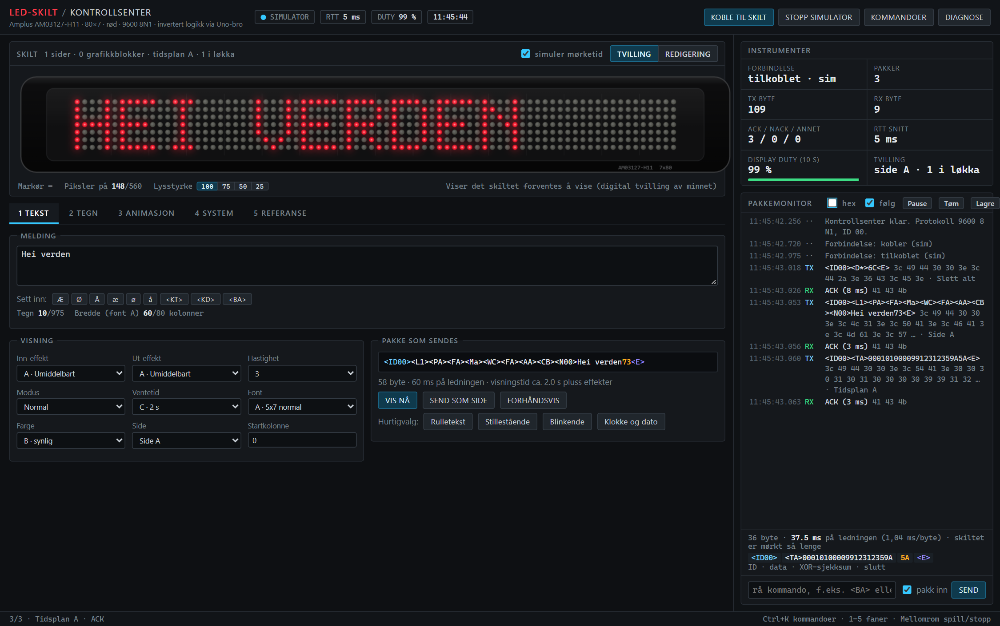

**Innhold**

1. [Før du starter](#1-før-du-starter)
2. [Åpne og koble til](#2-åpne-og-koble-til)
3. [Skjermen i korte trekk](#3-skjermen-i-korte-trekk)
4. [Fane 1: TEKST](#4-fane-1-tekst)
5. [Fane 2: TEGN](#5-fane-2-tegn)
6. [Fane 3: ANIMASJON](#6-fane-3-animasjon)
7. [Fane 4: SYSTEM og fane 5: REFERANSE](#7-fane-4-system-og-fane-5-referanse)
8. [Pakkemonitor og instrumenter](#8-pakkemonitor-og-instrumenter)
9. [Hurtigtaster og kommandopalett](#9-hurtigtaster-og-kommandopalett)
10. [Oppskrifter: vanlige oppgaver](#10-oppskrifter-vanlige-oppgaver)
11. [Hvis noe ikke virker](#11-hvis-noe-ikke-virker)
12. [Ordliste](#12-ordliste)

---

## 1. Før du starter

Du trenger:

- Skiltet, strøm (12 V) og en **Arduino Uno** koblet mellom PC og skilt som i [hardware.md](hardware.md). Uno-en må ha fått bro-programmet (`arduino/bridge_inv/bridge_inv.ino`) lastet opp én gang.
- **Chrome eller Edge** på PC-en. Firefox og Safari kan ikke snakke med USB-enheter fra nettsider.

Har du ikke skiltet for hånden? Trykk **SIMULATOR** (se under). Alt virker i simulatoren, og skiltet på skjermen viser hva som ville skjedd.

## 2. Åpne og koble til

**Åpne appen** på én av to måter:

- Nettsiden (hvis den er rullet ut): <https://led-skilt-kontrollsenter.web.app/>
- Lokalt fra repoet: kjør `kontrollsenter/start.bat` (eller `python kontrollsenter/serve.py`).

**Koble til skiltet:**

1. Sett USB-kabelen i Uno-en og slå på skiltet (12 V).
2. Trykk **KOBLE TIL SKILT** øverst til høyre.
3. Velg «Arduino Uno» i listen (første gang). Neste gang bruker appen den samme uten å spørre. Hold **Skift** mens du trykker hvis du vil velge en annen port.
4. Vent ca. 3 sekunder: Uno-en starter på nytt når porten åpnes. Appen sender så en kontakttest og sier fra om skiltet svarer.

  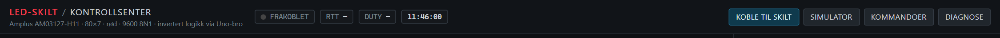 
  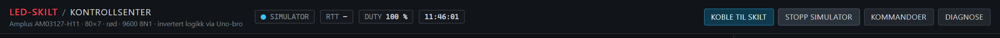

I toppfeltet ser du:

| Felt | Betyr |
|---|---|
| **FRAKOBLET / TILKOBLET / SIMULATOR** | Hvor du er koblet til |
| **RTT** | Hvor raskt skiltet svarer (millisekunder) |
| **DUTY** | Andel av de siste 10 sekundene skiltet har vist innhold. Det er mørkt mens det mottar data, så tallet faller mens du laster opp. |
| Klokken | PC-ens klokke |

> **Tips:** Hvis tilkoblingen faller ut (for eksempel USB-kabelen løsner), kobler appen seg til igjen av seg selv når Uno-en er tilbake. Du kan også bare trykke **KOBLE TIL SKILT** på nytt.

## 3. Skjermen i korte trekk

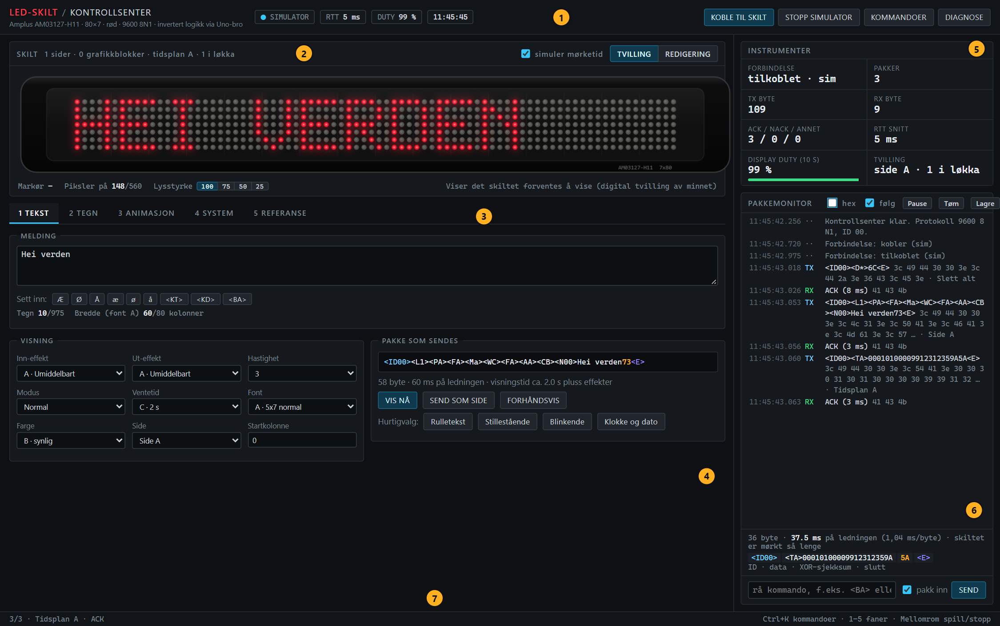

| Nr. | Del | Hva den gjør |
|---|---|---|
| 1 | **Topplinje** | Koble til, simulator, kommandoer (Ctrl+K), diagnose, og status |
| 2 | **Skiltet** | En kopi av skiltet. I TVILLING-visning ser du det skiltet forventes å vise. I REDIGERING tegner du direkte på det. Under: markørposisjon, antall tente piksler og lysstyrke. |
| 3 | **Faner** | TEKST, TEGN, ANIMASJON, SYSTEM og REFERANSE. Tastene 1–5 bytter fane. |
| 4 | **Innholdet i fanen** | Alt du kan gjøre i den valgte fanen |
| 5 | **Instrumenter** | Pakker, byte, ACK/NACK, svartid og «display duty» |
| 6 | **Pakkemonitor** | Alt som sendes til og kommer fra skiltet, med mulighet for å sende egne kommandoer |
| 7 | **Statuslinje** | Siste melding og hurtigtaster |

### TVILLING eller REDIGERING?

- **TVILLING** viser det skiltet *forventes å vise*: appen holder en modell av skiltets minne og spiller av sider, bilder og tidsplaner på samme måte som skiltet. Dette er det du ser i fanene TEKST og SYSTEM.
- **REDIGERING** viser bildet *du jobber med*. Du klikker og drar rett på skiltet for å tegne. Fanene TEGN og ANIMASJON bruker denne visningen.

Du kan bytte med knappene øverst til høyre i skilt-panelet.

> **Merk:** Appen kan ikke lese hva skiltet *faktisk* viser. Tvillingen er en modell, så den viser ikke effekter som å rulle inn.

## 4. Fane 1: TEKST

Her skriver du en melding og velger hvordan den vises.

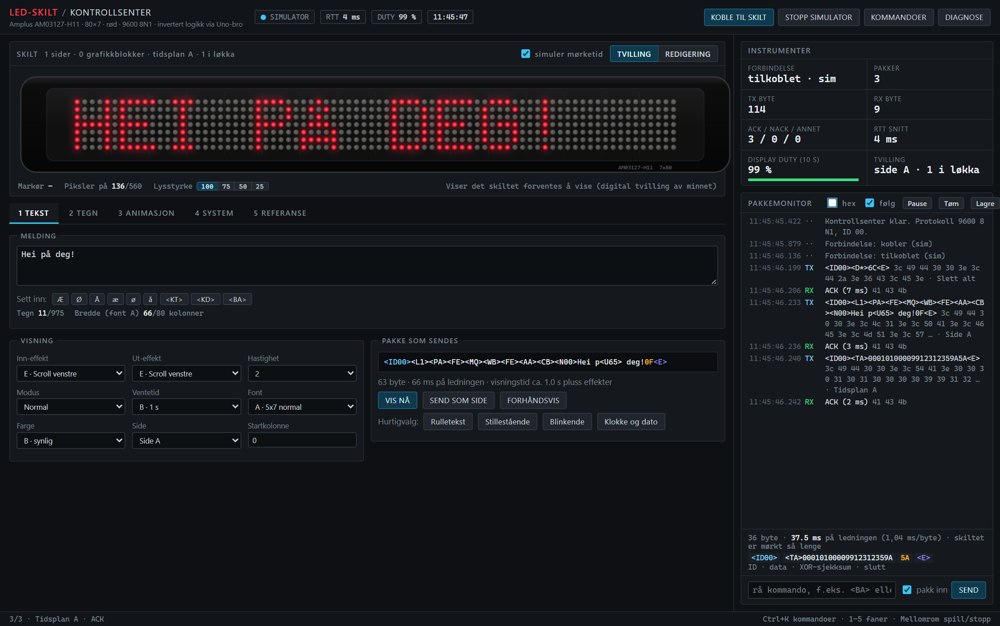

**Slik viser du en tekst:**

1. Skriv meldingen i feltet **Melding**. Bruk **Æ Ø Å æ ø å** direkte fra tastaturet, eller knappene under feltet. Appen oversetter dem til skiltets egne tegnkoder.
2. Velg visning under **Visning**, eller trykk et **Hurtigvalg**:
   - **Rulletekst:** teksten ruller inn fra høyre. Bra for lange meldinger.
   - **Stillestående:** teksten står stille.
   - **Blinkende:** teksten blinker.
   - **Klokke og dato:** viser klokkeslett og dato fra skiltets egen klokke.
3. Trykk **VIS NÅ**. Det sletter skiltets minne, sender teksten og starter visningen.

Under feltet ser du hvor mange tegn du har brukt (maks 975) og hvor bred teksten blir. **Skjermen er 80 kolonner bred, og hvert tegn tar 6 kolonner**, så en stillestående tekst kan ha ca. 13 tegn. Lengre tekster bør rulle inn, ellers blir slutten kuttet.

**Valgene under Visning:**

| Valg | Hva det gjør |
|---|---|
| Inn-effekt | Hvordan teksten kommer på skjermen (rulle, gardin, snø, …) |
| Ut-effekt | Hvordan den forsvinner. «Hold» lar den bli stående. |
| Hastighet | 1 (raskest) til 4 (tregest) |
| Modus | Normal, blinkende, eller en av tre innebygde melodier |
| Ventetid | Hvor lenge teksten står før neste side (0,5–25 s) |
| Font | A (normal), B (fet) og C (smal). D og E virker ikke på dette skiltet. |
| Farge | Skiltet er rødt. Fargene merket «usynlig» (grønne) vises ikke. |
| Side | A–Z: skiltet kan lagre 26 sider |
| Startkolonne | Hvor teksten starter (0 = helt til venstre) |

**SEND SOM SIDE** sender bare siden og sletter ingenting (nyttig når du bygger flere sider). **FORHÅNDSVIS** viser teksten på skjermen uten å sende. Boksen **Pakke som sendes** viser nøyaktig hva som går til skiltet.

> **Tips:** Sett inn `<KT>` og `<KD>` i teksten for å få klokkeslett og dato inn i meldingen, og `<BA>` for et kort bip.

## 5. Fane 2: TEGN

Her tegner du bilder piksel for piksel. Selve skiltet på skjermen er tegneflaten.

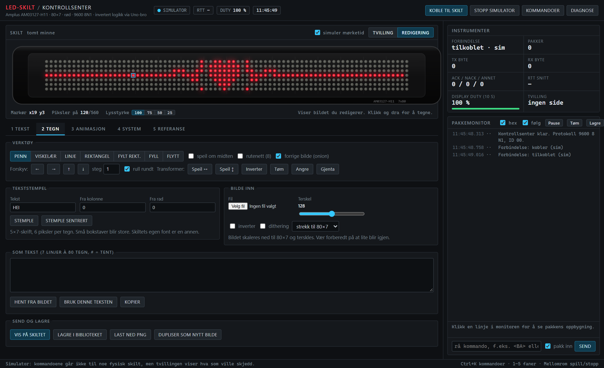

**Slik tegner du:**

1. Velg et verktøy: **PENN** (tegn), **VISKELÆR**, **LINJE**, **REKTANGEL**, **FYLT REKT.**, **FYLL** (fyller et område) eller **FLYTT** (dra hele bildet).
2. Klikk og dra på skiltet. **Høyreklikk** (eller hold Ctrl) visker ut med pennen.
3. Kryss av **speil om midten** for å tegne symmetrisk, og **rutenett** for å se en hjelpelinje hver 8. kolonne.
4. Trykk **VIS PÅ SKILTET** for å sende bildet.

**Flere verktøy:**

| Verktøy | Hva |
|---|---|
| **Forskyv** ← → ↑ ↓ | Flytter hele bildet. Med «rull rundt» kommer det som går ut på den ene siden inn på den andre. |
| **Speil ↔ / ↕, Inverter, Tøm** | Snur, bytter av og på, eller tømmer bildet |
| **Angre / Gjenta** | Ctrl+Z og Ctrl+Y |
| **Tekststempel** | Stempler tekst (5×7-skrift) i bildet. «Stemple sentrert» legger den midt på skjermen. |
| **Bilde inn** | Last inn et bilde (PNG, JPG). Det krympes til 80×7 og gjøres svart-hvitt. Juster **Terskel** til det ser bra ut. «Dithering» gir en prikkete skygge. |
| **Som tekst** | Bildet som 7 linjer med `#` (tent) og `.` (av). Kan kopieres og limes inn igjen. |
| **LAGRE I BIBLIOTEKET** | Lagrer bildet i nettleseren din |
| **LAST NED PNG** | Lager en bildefil |

> **Tips:** **Forrige bilde (onion)** viser det forrige bildet i animasjonen som et svakt skjær, så du ser hvor ting var. Praktisk når du lager animasjoner.

## 6. Fane 3: ANIMASJON

Skiltet spiller animasjoner **selv** når de er lastet inn. Appen laster inn bildene én gang, og skiltet blar mellom dem. Raskeste fart er 2 bilder per sekund. En animasjon kan ha **26 bilder** og vises i en løkke på **31 plasser** (15,5 sekunder); et bilde kan ta flere plasser for å stå lenger.

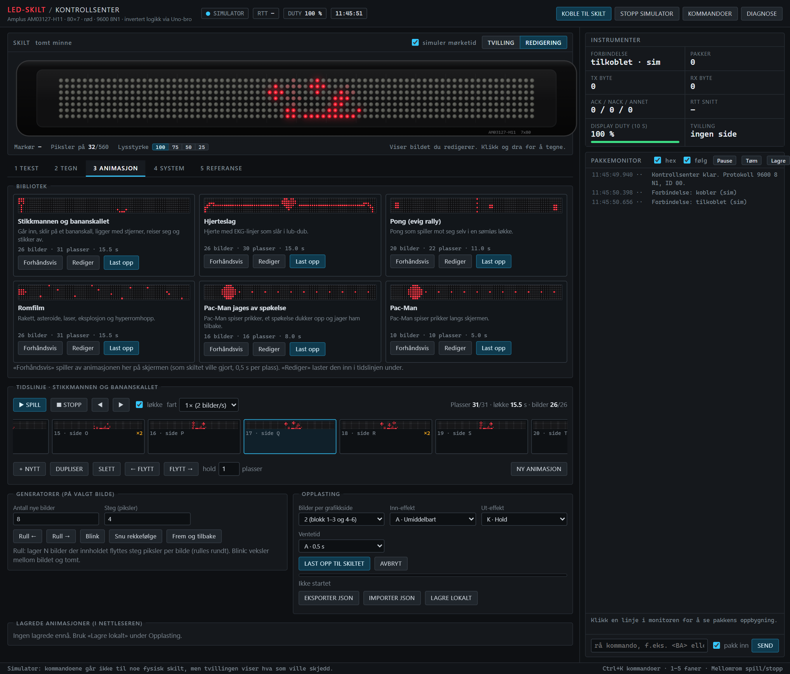

### Bruke en ferdig animasjon

I **Biblioteket** ligger seks ferdige animasjoner: *Stikkmannen og bananskallet, Hjerteslag, Pong, Romfilm, Pac-Man jages av spøkelse* og *Pac-Man*. For hver av dem:

- **Forhåndsvis:** spiller animasjonen på skjermen her (som skiltet ville gjort). Trykk igjen for å stoppe.
- **Rediger:** laster den inn i tidslinjen, så du kan endre den.
- **Last opp:** sender den til skiltet. Det tar rundt 10 sekunder, og skjermen blinker mens det pågår.

### Lage din egen

1. Trykk **NY ANIMASJON**. Du får ett tomt bilde i **Tidslinjen**.
2. Tegn bildet (på skiltet, som i fanen TEGN).
3. Trykk **+ NYTT** (tomt bilde) eller **DUPLISER** (kopi av bildet du står på), og endre litt. Gjenta.
4. Trykk **SPILL** for å se resultatet på skjermen. **fart** og **løkke** styrer avspillingen.
5. Trykk **LAST OPP TIL SKILTET**.

**Tidslinjen:**

| Knapp | Hva |
|---|---|
| **+ NYTT / DUPLISER / SLETT** | Legg til, kopier eller fjern et bilde |
| **← FLYTT / FLYTT →** | Endre rekkefølgen |
| **hold** | Hvor mange plasser bildet varer (×2 = 1 sekund). Vises som «×2» på bildet. |

Tallene øverst viser **plasser** (maks 31), **løkkelengde** og **bilder** (maks 26). De blir røde hvis du går over.

**Generatorer** lager mange bilder for deg ut fra bildet du står på:

| Generator | Resultat |
|---|---|
| **Rull ←** / **Rull →** | Flytter innholdet «steg» piksler per bilde, N bilder. Fin for tekst som beveger seg. |
| **Blink** | Legger til et tomt bilde etter det valgte |
| **Snu rekkefølge** | Spiller animasjonen baklengs |
| **Frem og tilbake** | Legger til bildene i omvendt rekkefølge, så den går frem og tilbake |

**Opplasting:** de forvalgte innstillingene (to bilder per grafikkside, utgående effekt «Hold», ventetid 0,5 s) gir blinkefri animasjon og passer nesten alltid. Fremdriftslinjen viser hvor langt opplastingen har kommet, og **AVBRYT** stopper den.

**Eksporter og lagre:** **EKSPORTER JSON** lager en fil du kan dele eller ta vare på, **IMPORTER JSON** leser en slik fil, og **LAGRE LOKALT** lagrer den i nettleseren (den dukker opp under «Lagrede animasjoner»).

## 7. Fane 4: SYSTEM og fane 5: REFERANSE

Skiltets innstillinger og verktøy.

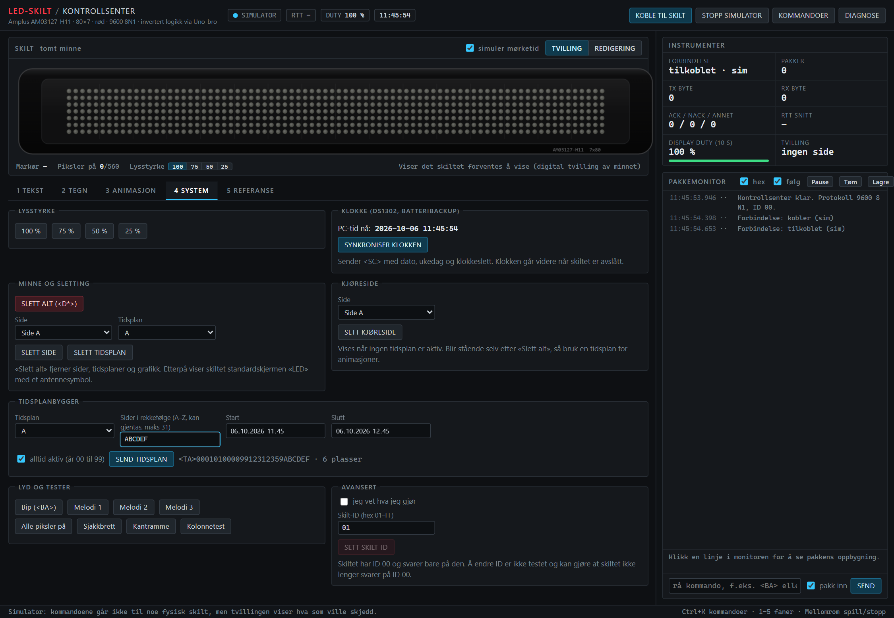

| Seksjon | Hva du kan gjøre |
|---|---|
| **Lysstyrke** | 100, 75, 50 eller 25 %. Det samme finner du under skiltet. |
| **Klokke** | **SYNKRONISER KLOKKEN** setter skiltets klokke til PC-ens tid. Klokken går videre selv om skiltet slås av (den har batteri). |
| **Minne og sletting** | **SLETT ALT** tømmer skiltet (sider, tidsplaner, bilder). **SLETT SIDE** og **SLETT TIDSPLAN** fjerner enkeltdeler. |
| **Kjøreside** | Siden skiltet viser når ingen tidsplan er aktiv. Bruk den bare til enkle, stillestående visninger. |
| **Tidsplanbygger** | Bestemmer hvilke sider som vises, i hvilken rekkefølge. Se under. |
| **Lyd og tester** | Bip, de tre melodiene, og testbilder (alle piksler på, sjakkbrett, kantramme, kolonnetest) til å sjekke at alle LED-ene virker |
| **Avansert** | Endre skiltets ID. **Ikke bruk** med mindre du vet hvorfor: skiltet svarer da ikke lenger på vanlig ID. |

**Tidsplanbygger:** skriv sidene som bokstaver i rekkefølge (for eksempel `ABAC` viser A, B, A, C og begynner så på nytt; maks 31 plasser). Velg **alltid aktiv**, eller et tidsrom, og trykk **SEND TIDSPLAN**. Boksen viser den ferdige kommandoen.

> **Viktig:** En **kjøreside** blir stående selv etter «Slett alt», og da vises bare den siden. Animasjoner bruker derfor alltid en tidsplan. Hvis en animasjon står stille på bare ett bilde, er en gammel kjøreside årsaken.

### Fane 5: REFERANSE

Et oppslagsverk i selve appen: alle effekter, hastigheter, fonter og farger (med hvilke som virker), hvordan norske tegn kodes (med en liten omformer du kan prøve tekst i), grafikkformatet og grenser som er målt på skiltet. Du trenger den sjelden, men den svarer raskt på «hva betyr kode X?».

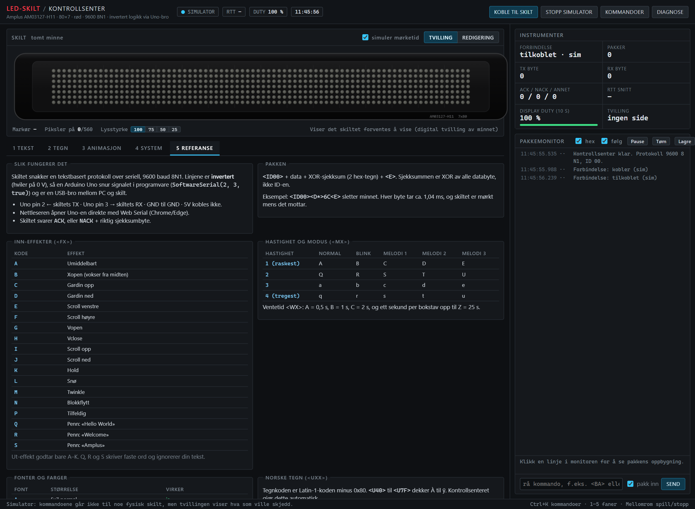

## 8. Pakkemonitor og instrumenter

Til høyre ser du alt som skjer mellom appen og skiltet. Det er ikke nødvendig for vanlig bruk, men utmerket når noe er uklart.

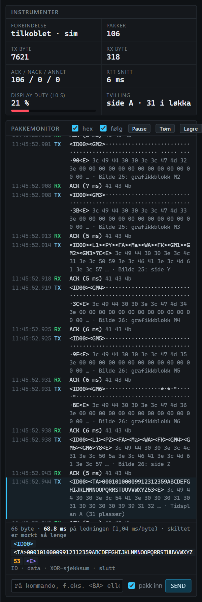

- **TX** er det appen sender, **RX** er svaret. `ACK` betyr «forstått». `NACK` betyr feil sjekksum.
- **Klikk på en linje** for å se pakkens deler nederst: ID (blå), data (hvit), sjekksum (gul) og slutt (lilla), og hvor lenge skiltet er mørkt mens pakken sendes.
- **hex** viser rå byte, **følg** ruller til nyeste linje. **Pause**, **Tøm** og **Lagre** (til en tekstfil).
- Nederst kan du **sende en egen kommando**. Skriv for eksempel `<BA>`; «pakk inn» legger på ID, sjekksum og slutt for deg.
- **Instrumentene** øverst teller pakker og byte og viser gjennomsnittlig svartid. **Display duty** viser hvor stor andel av tiden skiltet har vist innhold (laveste under opplasting).

## 9. Hurtigtaster og kommandopalett

| Tast | Gjør |
|---|---|
| **1 – 5** | Bytt fane |
| **Ctrl+K** | Åpne kommandopaletten |
| **Mellomrom** | Spill/stopp animasjon (i fanene ANIMASJON og TEGN) |
| **← →** | Forrige/neste bilde (i ANIMASJON) |
| **P, E, L, R, B, F, M** | Penn, viskelær, linje, rektangel, fylt rektangel, fyll, flytt (i TEGN) |
| **Ctrl+Z / Ctrl+Y** | Angre / gjenta |
| **Skift+F12** | Diagnose |

**Kommandopaletten** (Ctrl+K) lar deg skrive det du vil gjøre i stedet for å lete etter knappen: «lys» for lysstyrke, «klokke» for å synkronisere klokken, «nullstill» for å lukke en port som har satt seg fast.

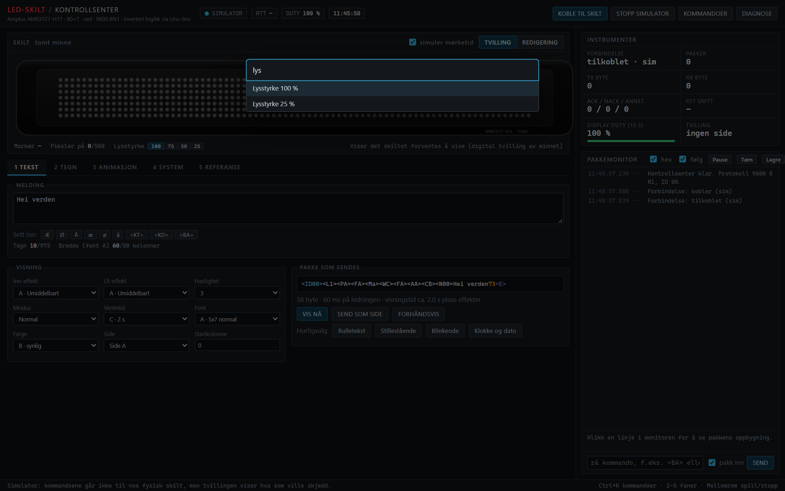

## 10. Oppskrifter: vanlige oppgaver

**Vise en rulletekst**
1. Fane **TEKST**. Skriv teksten.
2. Trykk hurtigvalget **Rulletekst**, og så **VIS NÅ**.

**Vise klokkeslett og dato**
1. Fane **SYSTEM** → **SYNKRONISER KLOKKEN** (bare nødvendig første gang, eller etter at batteriet har vært ute).
2. Fane **TEKST** → hurtigvalget **Klokke og dato** → **VIS NÅ**.

**Tegne et bilde og vise det**
1. Fane **TEGN**. Tegn direkte på skiltet (eller bruk **Tekststempel** eller **Bilde inn**).
2. Trykk **VIS PÅ SKILTET**.

**Spille av en ferdig animasjon**
1. Fane **ANIMASJON**. Trykk **Forhåndsvis** på en animasjon i biblioteket for å se den først.
2. Trykk **Last opp**. Vent til fremdriftslinjen er full. Skiltet spiller den selv.

**Lage en egen animasjon**
1. Fane **ANIMASJON** → **NY ANIMASJON**. Tegn første bilde.
2. **DUPLISER**, endre litt, gjenta. Bruk **Rull**-generatorene for tekst eller figurer som beveger seg.
3. **SPILL** for å teste, **LAST OPP TIL SKILTET** for å sende den, og **EKSPORTER JSON** for å ta vare på den.

**Tømme skiltet**
Fane **SYSTEM** → **SLETT ALT**. Skiltet viser deretter «LED» og et antennesymbol til du sender noe nytt.

**Gjøre skiltet mørkere (for eksempel om natten)**
Under skiltet, eller fane **SYSTEM** → **Lysstyrke** → 25 %.

**Teste at alle lysene virker**
Fane **SYSTEM** → **Lyd og tester** → **Alle piksler på**.

## 11. Hvis noe ikke virker

Trykk **DIAGNOSE** (eller Skift+F12). Du får en oversikt over nettleser, tilkobling og status for alle deler av appen, og en **selvtest** på 12 punkter. **Kopier rapport** gir en tekst du kan lime inn når du ber om hjelp.

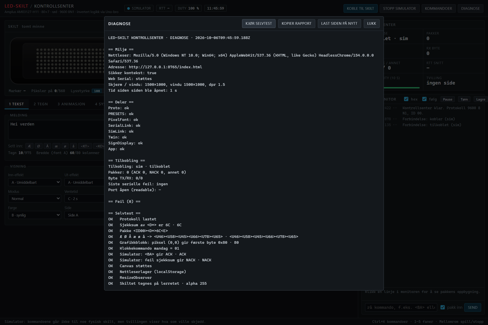

| Symptom | Prøv dette |
|---|---|
| Siden er tom, knappene gjør ingenting | Last siden på nytt med **Ctrl+Shift+R**. Lokalt: bruk `start.bat`, ikke en egen enkel webserver. |
| «Web Serial støttes ikke» | Bruk Chrome eller Edge. |
| «Ingen svar fra skiltet» etter tilkobling | Er skiltet slått på (12 V)? Sitter ledningene fra Uno pin 2 og 3 på TX og RX, og er GND koblet? Står RESET-jumperen *ikke* på? |
| Svar med «støy» (`ff`-bytes) | GND-ledningen mellom Uno og skilt har løsnet. |
| «The port is already open» | En gammel forbindelse sitter fast. Last siden på nytt, eller bruk «Nullstill seriellport» i kommandopaletten. |
| Teksten er kuttet i enden | Den er bredere enn 80 kolonner. Bruk innrulling (Rulletekst) eller kortere tekst. |
| Animasjonen står stille på ett bilde | En gammel kjøreside. Last opp animasjonen på nytt: appen bruker en tidsplan. |
| Animasjonen blinker | Bruk utgående effekt «Hold» (forvalgt) og ventetid 0,5 s under **Opplasting**. |
| Skiltet er mørkt under opplasting | Normalt. Skiltet viser ikke noe mens det mottar data. |

Se også [funn-og-avvik.md](funn-og-avvik.md) for alt som oppfører seg annerledes enn databladet sier.

## 12. Ordliste

| Ord | Betyr |
|---|---|
| **Side** | Én visning i skiltets minne (A–Z). En tekst eller et bilde er en side. |
| **Tidsplan** | En liste over hvilke sider som vises og i hvilken rekkefølge (A–E, opptil 31 sider hver). |
| **Kjøreside** | Siden som vises når ingen tidsplan er aktiv. |
| **Effekt** | Hvordan en side kommer inn og går ut (rulle, gardin, snø …). |
| **Hold** | Utgående effekt som lar bildet stå til neste kommer. Gir blinkefri animasjon. |
| **Grafikkblokk** | Skiltets format for bilder: 32×8 piksler. Tre blokker dekker hele skjermen. |
| **ACK / NACK** | Skiltets svar: forstått / feil sjekksum. |
| **Tvilling** | Appens modell av skiltets minne, som viser hva skiltet forventes å vise. |
| **Display duty** | Andel av tiden skiltet viser innhold. |
| **Uno-bro** | Arduinoen som snur skiltets inverterte signaler, så en vanlig USB-forbindelse virker. |

---

**Mer å lese:** [maskinvare](hardware.md) · [protokoll](protokoll.md) · [animasjonsteknikk](animasjoner.md) · [utviklerdokumentasjon for appen](kontrollsenter.md) · [hosting med Firebase](firebase.md)
