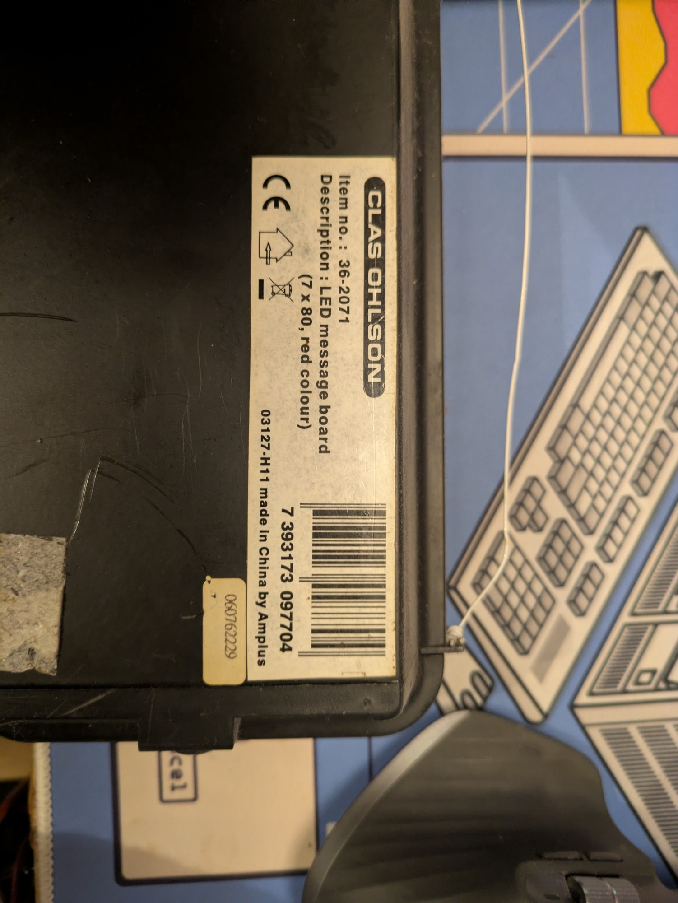
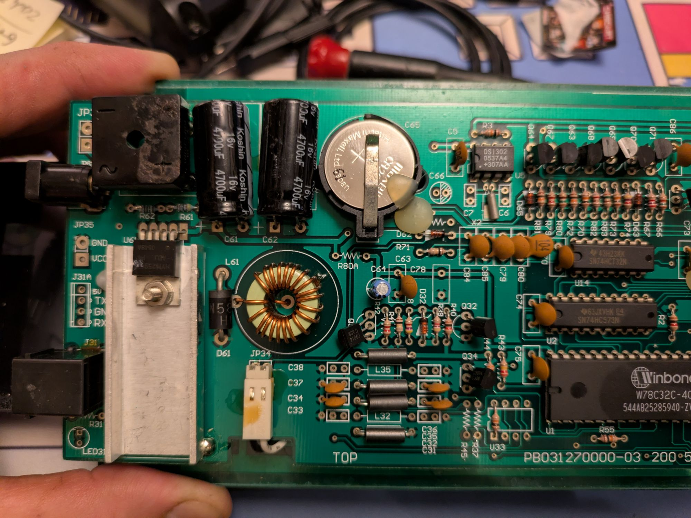
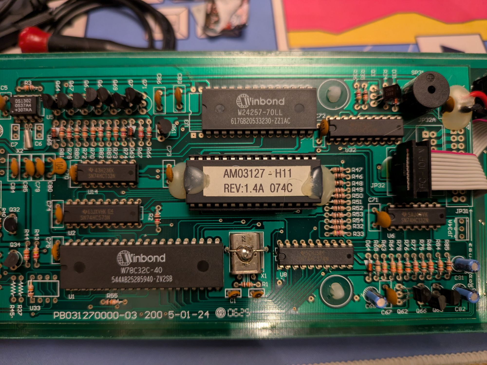
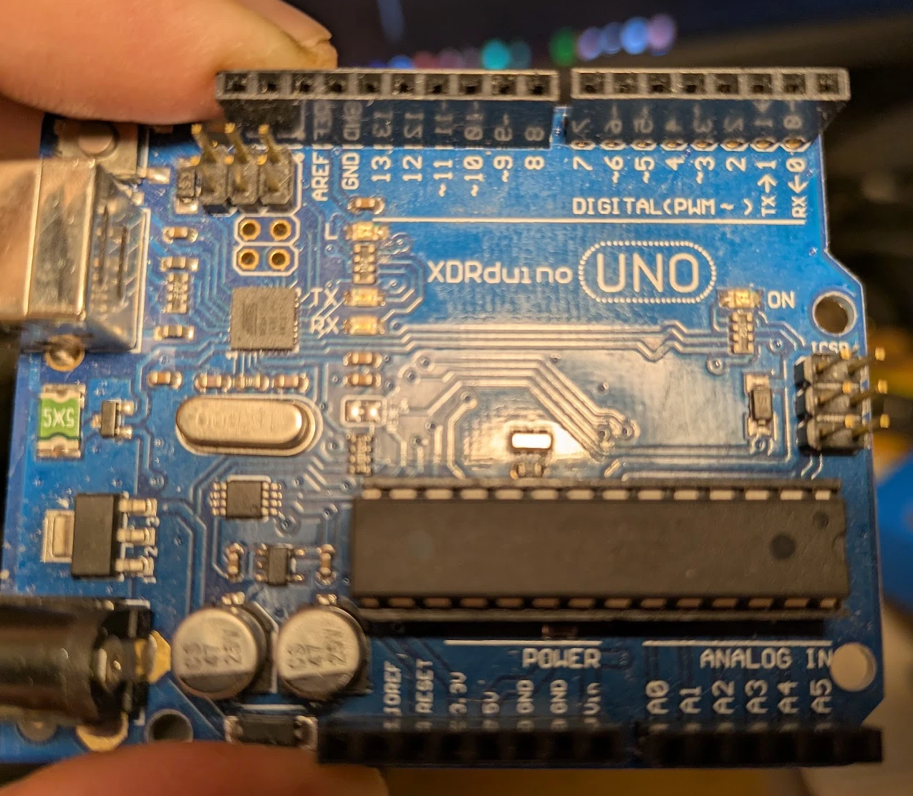

# Maskinvare

## Hva skiltet er

Skiltet er et **Clas Ohlson 36-2071** («LED message board, 7 × 80, red colour»), produsert av Amplus i Kina. Etiketten viser kontrollerkortet **03127-H11**, og brikken på kortet er merket **AM03127-H11 REV 1.4A**. Det er den samme kontrolleren som finnes i en rekke «moving message»-skilt (blant annet MC CRYPT AM03127-H11), og den snakker en dokumentert seriellprotokoll.

Skiltet har 7 rader og 80 kolonner røde LED-er (560 punkter) og fungerer derfor som **én tekstlinje**. I grafikkmodus kan hvert punkt styres hver for seg.

## Kontrollerkortet

Alt under er lest av kretskortbildene. Typenumre som ikke var leselige er merket som usikre.

| Del | Merking / type | Funksjon |
|---|---|---|
| Kretskort | PB031270000-03, 2005-01-24 | Kontrollerkort, kopi av Amplus-referansedesign |
| Mikrokontroller (U1) | Winbond W78C32C-40 | 8032-kompatibel, kjører firmwaren og UART-en |
| Firmware | Sokkelmontert brikke merket «AM03127-H11 REV:1.4A 074C» | Programkode (kan i prinsippet leses ut) |
| SRAM (U3) | Winbond W24257-70LL | 32 KB, lagrer sider, tidsplaner og grafikk |
| Sanntidsklokke (U5) | DS1302 med CR2032-batteri | Holder dato og tid når skiltet er av |
| Krystall (X1) | Merket «22.…» (trolig 22,1184 MHz, ikke bekreftet) | Klokke for MCU, passer 9600 baud |
| Logikk | 74HC573 (U2), 74HCT32 (U14), 74HC132 (U6), flere 74HC-brikker | Adressedekoding, radmultipleksing |
| Panelskiftere | 74HC164 (flere) | Kolonnedata til LED-panelet |
| Radtransistorer | C9014-lignende (Q61–Q71) | Styrer LED-radene |
| Summer (SP31) | Liten summer | «Bell» og tre innebygde melodier |
| Panelkabel (JP32) | 10-pins flatkabel (FC-10P) | Kontroller til LED-panel |
| Seriell (J31A) | 4 pinner: 5V, TX, GND, RX | Seriellgrensesnittet som brukes her |
| Seriell (J31) | RJ11-kontakt på enden av skiltet | Trolig samme signaler (ikke målt) |

  
  

## Strøm

Skiltet går på **12 V likestrøm**.

| Egenskap | Verdi | Kilde |
|---|---|---|
| Driftsspenning | 12 V DC | Bekreftet; stemmer med MC CRYPT AM03127-H11-manualen |
| Anbefalt adapter | 12 V DC, minst 1 A | MC CRYPT-manualen oppgir 12 V / 2,5 A for en større variant. Strømtrekket til dette skiltet er ikke målt. |
| Polaritet | Likegyldig | Brolikeretter rett bak DC-jacken |
| Indre 5 V | Ca. 5 V på J31A-pinnen merket 5V | Målt med multimeter |
| Inngangskondensatorer | 2 × 4700 µF / 16 V | Sett på kretskortet |

- **Hold deg til 12 V DC, aldri over ca. 13 V.** Kondensatorene er dimensjonert for 16 V, og likeretteren tar rundt 1,4 V.
- **Ikke bruk vekselstrøm.** 12 V AC har en toppverdi på ca. 17 V.
- 12 V reduseres til 5 V av en buck-regulator (U61 på kjøleribbe, toroidspole L61, Schottky-diode D61). Typenummeret på U61 var ikke leselig.
- **5V-pinnen er en utgang.** Ikke koble en ekstern 5 V-kilde til den.

## Seriellgrensesnittet

**9600 baud, 8 databiter, ingen paritet, 1 stoppbit (8N1).**

Målinger på J31A mot GND, skiltet på 12 V:

| Pinne | Målt i hvile | Tolkning |
|---|---|---|
| 5V | 5 V | Forsyningsutgang |
| TX (skiltets utgang) | ca. 0,1 V | En vanlig TTL-UART hviler på +5 V. Dette er **invertert logikk**. |
| RX (skiltets inngang) | 0 V | Samme tolkning |

Bekreftelsen kom da en Arduino Uno med inverterte softwareserielle porter fikk skiltet til å svare `ACK`, mens en vanlig (ikke-invertert) forbindelse ikke ga noe svar.

Pinnerekkefølgen på J31A er (sett ovenfra på kortet, kontaktene ved venstre kant): **5V, TX, GND, RX**. RJ11-kontakten (J31) er trolig koblet til de samme signalene. For andre Amplus-skilt oppgir [ambor.com](https://blog.ambor.com/2020/04/driving-led-panel-with-spreadsheet.html) pinnene som GND, TXD, RXD fra toppen. Dette er **ikke målt** på dette skiltet.

## Koblingen med Arduino Uno

Uno-en snur signalene i programvare og fungerer som USB-bro. Sketchen er [`arduino/bridge_inv/bridge_inv.ino`](../arduino/bridge_inv/bridge_inv.ino).

| Arduino Uno | Skiltets J31A | Merknad |
|---|---|---|
| Digital pin 2 | TX | Fra skiltet til Uno (mottak) |
| Digital pin 3 | RX | Fra Uno til skiltet (sending) |
| GND | GND | Felles jord |
| (ingen) | 5V | **Skal ikke kobles** |

Pin 0 og 1 på Uno-en brukes ikke. **RESET-jumperen skal ikke sitte på** når du laster opp sketchen eller bruker broen.

Sketchen bruker `SoftwareSerial sign(2, 3, true)`; det siste argumentet er *inverse logic*. Den videresender alt fra USB til skiltet og omvendt, byte for byte.

Port-åpning på PC-en **resetter Uno-en** (DTR), så vent ca. 2,5 sekunder etter at porten er åpnet før første kommando.

## Maskinvarefeil man kan treffe

| Symptom | Årsak |
|---|---|
| Ingen svar i det hele tatt | Skiltet er avslått, 12 V mangler, eller pin 2 og 3 er løse eller byttet om |
| Svar som bare består av `ff`-bytes | **GND-ledningen har falt ut** (observert) |
| Teksten vises, men ingen `ACK` | Ledningen fra skiltets TX til Uno pin 2 sitter løst |
| Opplasting av Uno-sketch feiler | RESET-jumperen sitter på |
