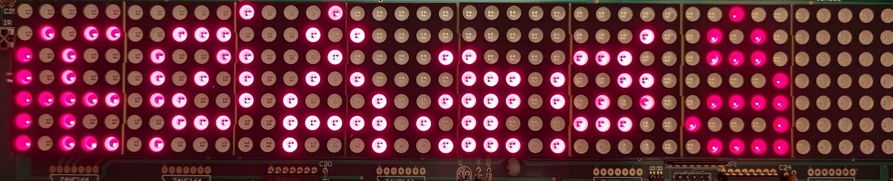
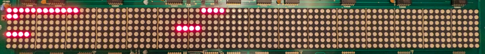

# Protokollreferanse

Kilde: Amplus «AM004-03128/03127 LED Display Board Communication», versjon 2.2 (2005). Alt merket **testet** er bekreftet mot et ekte skilt (REV 1.4A). Alt annet er hentet fra dokumentet og ikke prøvd.

## Pakken

```
<IDxx> + data + sjekksum + <E>
```

| Del | Innhold |
|---|---|
| `<IDxx>` | Mottaker-ID som to hex-tegn. Dette skiltet har **ID 00** og svarer bare på den. |
| data | Én kommando (se under) |
| sjekksum | XOR av alle databyte (ikke ID-en), som to store hex-tegn |
| `<E>` | Slutt |

Eksempel (sletter minnet): `<ID00><D*>6C<E>`; 6C er XOR av tegnene `<`, `D`, `*`, `>`.

```python
def checksum(data):
    x = 0
    for ch in data.encode("latin-1"):
        x ^= ch
    return f"{x:02X}"
```

### Svar fra skiltet (testet)

| Svar | Betydning |
|---|---|
| `ACK` | Kommandoen ble godtatt |
| `NACK` + ett byte | **Feil sjekksum.** Byten er den riktige sjekksummen (ikke dokumentert) |
| `NACK` alene | Ukjent kommando eller tomt datafelt |
| ingen svar | ID stemmer ikke |

`ACK` betyr at kommandoen ble godtatt, ikke at noe er synlig. Skiltet validerer ikke alle parametere (for eksempel blir både sidenavn `[` og `a` og linjenummer 0–9 godtatt).

## Sidekommandoen

```
<L1><PA><FE><Ma><WA><FE><AA><CB><N00>Hei verden
```

| Kode | Parameter |
|---|---|
| `<L1>` | Linje 1 (skiltet har bare én synlig linje; L0–L9 godtas) |
| `<PA>` | Side A–Z |
| `<FE>` | Innledende effekt (tabell under) |
| `<Ma>` | Visningsmodus og hastighet |
| `<WA>` | Ventetid |
| `<FE>` | Avsluttende effekt (A–K) |
| `<AA>` | Font |
| `<CB>` | Farge |
| `<N00>` | Startkolonne (00–FF) |
| tekst | ASCII 20H–7FH, `<Uxx>` for norske tegn, `<KT>`, `<KD>`, `<BA>` |

### Effekter

| Kode | Effekt | Merknad |
|---|---|---|
| A | Umiddelbart | |
| B | Xopen, vokser ut fra midten | |
| C / D | Gardin opp / ned | |
| E / F | Scroll venstre / høyre | Bildet ruller inn fra motsatt side |
| G / H | Vopen / Vclose | |
| I / J | Scroll opp / ned | |
| K | Hold | Som utgående effekt blir bildet stående til neste side tegnes |
| L | Snø | Bare innledende |
| M | Twinkle | Bare innledende |
| N | Blokkflytt | Bare innledende |
| P | Tilfeldig | Bare innledende |
| Q, R, S | Penn: skriver faste ord, **ikke din tekst** («Hello World», «Welcome», «Amplus») | Testet |

Alle effektene var tydelig forskjellige på skjermen. Utgående effekt godtar bare A–K.

### Hastighet, blinking og melodier (`<MX>`)

| Hastighet | Normal | Blinker | Melodi 1, 2, 3 |
|---|---|---|---|
| 1 (raskest) | A | B | C, D, E |
| 2 | Q | R | S, T, U |
| 3 | a | b | c, d, e |
| 4 (tregest) | q | r | s, t, u |

Ventetid `<WX>`: A = 0,5 s, B = 1 s, C = 2 s, deretter ett sekund per bokstav opp til Z = 25 s. Små bokstaver og tall gir `NACK`.

### Fonter og farger

| Font | Størrelse | Virker |
|---|---|---|
| A | 5×7 normal | ja |
| B | 6×7 fet | ja |
| C | 4×7 smal | ja |
| D | 7×13 stor | **nei**, for høyt skilt (kuttet) |
| E | 5×8 lang | **nei**, for høyt skilt (kuttet) |

Skiltet har bare røde LED-er. Fargekodene med grønt er **usynlige**: D, E, F og M. Alle de andre (A, B, C, G–L, N, P–S) lyser rødt.

### Norske tegn

`<Uxx>` der xx = Latin-1-koden minus 0x80. `<U40>` til `<U7F>` dekker À til ÿ. **Testet og riktig på skjermen:**

| Tegn | Kode | Tegn | Kode |
|---|---|---|---|
| Å | `<U45>` | å | `<U65>` |
| Æ | `<U46>` | æ | `<U66>` |
| Ø | `<U58>` | ø | `<U78>` |

<p align="center"></p>

## Øvrige kommandoer

| Kommando | Format | Status |
|---|---|---|
| Slett alt | `<D*>` | testet |
| Lysstyrke | `<BA>` til `<BD>` (100, 75, 50, 25 %) | testet, fire tydelige trinn |
| Klokke | `<SC>ÅÅUUMMDDttmmss` (UU = ukedag, mandag = 01) | testet |
| Klokke i tekst | `<KT>` (tt:mm, ingen sekunder), `<KD>` (DD/MM/ÅÅ) | testet |
| Bip | `<BX>` i teksten (A = 0,5 s opp til Z = 13 s ifølge databladet) | `<BA>` testet |
| Tidsplan | `<Tn>ÅÅMMDDttmmÅÅMMDDttmm` + sider (n = A–E, maks 31 sider, kan gjentas) | testet |
| Kjøreside | `<RPn>` | testet |
| Slett side/linje | `<DLxPn>` | ACK |
| Slett tidsplan | `<DTn>` | ACK |
| Sett skilt-ID | `<IDxx>` uten sjekksum | **ikke prøvd** |

## Grafikk (`<GXn>`)

En grafikkblokk er **32 × 8 piksler = 64 byte**, bygget av **fire 8×8-enheter** etter hverandre (16 byte hver). Innen en enhet er dataene radvis med 2 byte per rad, 4 piksler per byte, og **venstre piksel i de to høyeste bitene**.

| Pikselverdi | Betydning |
|---|---|
| `00` | av |
| `01` | grønn (usynlig på dette skiltet) |
| `10` | rød |
| `11` | gul (lyser rødt) |

Oppsettet ble funnet ved å tenne enkeltbyte og se hvor prikkene dukket opp:

| Byte | Plassering | Observert |
|---|---|---|
| 0, 1 | Enhet 1, rad 1, kolonne 1–8 | Prikker i kolonne 1–8 |
| 2 (= 0xE4) | Enhet 1, rad 2, kolonne 1–4 | Bare kolonne 1–2 lyser (verdi 11 og 10) |
| 8 | Enhet 1, rad 5, kolonne 1–4 | Fire prikker i rad 5 |
| 16 | Enhet 2, rad 1, kolonne 9–12 | Kolonne 9–12 i rad 1 |
| 55 | Enhet 4, rad 4, kolonne 29–32 | Fire prikker i rad 4 |
| Blokk 2, byte 0 | Kolonne 33–36, rad 1 | Fire prikker |

<p align="center"></p>

Skjermen er 80 kolonner, så **tre blokker** dekker den (blokk 2 starter i kolonne 33). Rad 8 vises ikke. Grafikken vises ved å sette `<GA1><GA2><GA3>` i siden; **uten** font-, farge- og kolonnekoder foran. Med `<AA><CB><N00>` foran ble siden ikke vist. Blokknummer 1–8 per grafikkside og sidene A–P er slik protokollen oppgir; skiltet godtar også andre verdier uten å klage.

```python
# 32 x 8-blokk fra 8 rader à 32 tegn ('#' = tent):
for unit in range(4):
    for row in range(8):
        for half in range(2):
            byte = 0
            for k in range(4):
                col = unit * 8 + half * 4 + k
                byte = (byte << 2) | (0b10 if rows[row][col] == "#" else 0)
            data.append(byte)
```

## Grenser (målt)

| Egenskap | Verdi |
|---|---|
| Skjerm | 80 × 7 piksler |
| Meldingslengde | **975 tegn tekst** med standard kommandohode (37 tegn). 976 gir `NACK`. |
| Sider | A–Z (26) |
| Tidsplaner | A–E, opptil 31 sider hver |
| Tegnbredde | 6 kolonner (font A); tekst bredere enn 80 kolonner kuttes |
| Seriell | 9600 baud, 8N1, invertert logikk |
| Minne | Sider, kjøreside og klokke overlever strømbrudd |

## Visningsregler som ikke er åpenbare

- **Uten tidsplan og uten kjøreside** veksler skiltet automatisk mellom alle lagrede sider.
- **Med en kjøreside** (`<RPn>`) vises bare den når ingen tidsplan er aktiv. Kjøresiden **blir stående selv etter `<D*>`** på dette skiltet.
- **En tidsplan som alltid er aktiv** (år 00 til 99) viser sidene i rekkefølge, og siden kan gjentas.
- **Etter `<D*>` uten noen sider** viste skiltet teksten «LED» og et antennesymbol (trolig standardskjermen).
- **Mørketid:** skiltet er mørkt mens det mottar serielle data. Se [animasjoner.md](animasjoner.md).
